# VERSATILE BY VERSHA' — Website Architecture & Flow Documentation

> **Brand**: VERSATILE BY VERSHA' — "One Woman. Every Look."
> **Platform**: Next.js 14 (App Router) + Firebase (Auth, Firestore, Storage) + Stripe
> **Last Updated**: 2026-07-27

---

## Table of Contents

1. [High-Level Architecture](#1-high-level-architecture)
2. [Technology Stack](#2-technology-stack)
3. [Project Structure](#3-project-structure)
4. [Routing Map](#4-routing-map)
5. [Context Provider Tree](#5-context-provider-tree)
6. [Authentication Flow](#6-authentication-flow)
7. [Home Page Flow](#7-home-page-flow)
8. [Shop & Product Listing Flow](#8-shop--product-listing-flow)
9. [Product Detail Flow](#9-product-detail-flow)
10. [Bundle Flow](#10-bundle-flow)
11. [Cart Flow](#11-cart-flow)
12. [Wishlist Flow](#12-wishlist-flow)
13. [Checkout Flow](#13-checkout-flow)
14. [Cash on Delivery (COD) Flow](#14-cash-on-delivery-cod-flow)
15. [Stripe Payment Flow](#15-stripe-payment-flow)
16. [Order Flow](#16-order-flow)
17. [Orders Page (Customer)](#17-orders-page-customer)
18. [Review Flow](#18-review-flow)
19. [Sale & Promo Code Flow](#19-sale--promo-code-flow)
20. [Admin Panel Flow](#20-admin-panel-flow)
21. [Database Collections](#21-database-collections)
22. [Service Layer](#22-service-layer)
23. [State Management](#23-state-management)
24. [API Routes](#24-api-routes)
25. [Error Flows](#25-error-flows)
26. [Edge Cases](#26-edge-cases)
27. [Known Issues](#27-known-issues)
28. [Suggested Improvements](#28-suggested-improvements)

---

## 1. High-Level Architecture

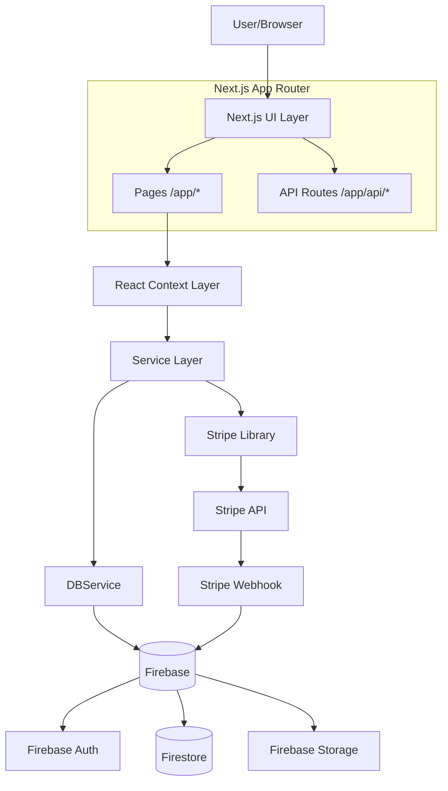

### Layer Responsibilities

| Layer | Responsibility |
|-------|---------------|
| **Next.js Pages** | Server/client-component rendering, routing, SEO metadata |
| **React Context** | Client-side state management for auth, cart, wishlist, orders |
| **Services** | Business logic, data transformation, Firebase interactions |
| **DBService** | Low-level Firestore CRUD + Firebase Storage file operations |
| **Firebase** | Auth (email/password, Google), Firestore (NoSQL), Storage (images) |
| **Stripe** | Payment processing, checkout sessions, webhook events |

---

## 2. Technology Stack

| Category | Technology | Version/Notes |
|----------|-----------|---------------|
| Framework | Next.js 14 | App Router, `"use client"` components throughout |
| Styling | Tailwind CSS | v3.4, custom `luxe-*` color tokens |
| Icons | Lucide React | v0.468 |
| Database | Firebase Firestore | v12.16 |
| Auth | Firebase Auth | Email/Password + Google OAuth |
| Storage | Firebase Storage | Product images, review images |
| Payments | Stripe | Checkout Sessions, Webhooks |
| Fonts | Google Fonts | Cormorant Garamond (serif), Poppins (sans) |

---

## 3. Project Structure

```
F:\wig\info\versatile\
├── app/                          # Next.js App Router
│   ├── layout.jsx                # Root layout (providers, navbar, footer)
│   ├── globals.css               # Tailwind + custom CSS
│   ├── page.jsx                  # Home page
│   ├── about/page.jsx            # About brand page
│   ├── admin/page.jsx            # Admin dashboard (718 lines)
│   ├── cart/page.jsx             # Shopping cart page
│   ├── checkout/
│   │   ├── page.jsx              # Checkout form (COD + Stripe)
│   │   ├── success/page.jsx      # Post-Stripe success page
│   │   └── cancelled/page.jsx    # Payment cancelled page
│   ├── contact/page.jsx          # Contact form page
│   ├── login/page.jsx            # Login page
│   ├── orders/page.jsx           # Customer order history
│   ├── product/[id]/page.jsx     # Product detail page
│   ├── shop/page.jsx             # Shop listing with filters
│   ├── signup/page.jsx           # Registration page
│   ├── wishlist/page.jsx         # Wishlist page
│   └── api/
│       ├── checkout/route.js     # POST: Create Stripe session
│       ├── checkout/verify/route.js  # GET: Verify order after payment
│       └── stripe/webhook/route.js   # POST: Stripe webhook handler
├── components/
│   ├── admin/                    # Admin panel components
│   │   ├── bundles/              # BundleForm, BundleList
│   │   ├── common/               # Field, ImageUploader, ToggleSwitch, etc.
│   │   ├── modals/               # RestockModal
│   │   ├── orders/               # OrdersSection, AdminOrderCard
│   │   ├── products/             # ProductForm, ProductCatalogList
│   │   └── sales/                # SaleManagerSection
│   ├── common/                   # Navbar, Footer, AnnouncementBar, LoadingShimmer
│   ├── ProductReviews/           # ProductReviews, ReviewCard, ReviewForm, RatingStars
│   └── shop/                     # ProductCard, BundleCard
├── config/
│   ├── firebase.js               # Firebase app initialization
│   └── config.js                 # Environment variable accessor
├── context/
│   ├── AuthContext.js             # Auth state provider
│   ├── CartContext.js             # Cart state provider
│   ├── OrderContext.js            # Order state provider (unused in pages)
│   └── WishlistContext.js         # Wishlist state provider
├── hooks/
│   └── useReviews.js              # Reviews data + permission hook
├── lib/
│   ├── stripe.js                  # Stripe SDK singleton (server-side)
│   ├── mockData.js                # Seed data for products, bundles, reviews
│   └── mockOrders.js              # Mock orders seed data
├── services/
│   ├── DBService.js               # Low-level Firestore/Storage abstraction
│   ├── AuthService.js             # Authentication + user profile
│   ├── OrderService.js            # Order CRUD + validation
│   ├── ProductService.js          # Product CRUD + variant stock
│   ├── BundleService.js           # Bundle CRUD
│   ├── SaleService.js             # Sale CRUD + promo code validation
│   ├── ReviewService.js           # Review CRUD + rating sync
│   └── WishlistService.js         # Wishlist CRUD
├── utils/
│   └── ratingUtils.js             # Pure functions: average, distribution
├── tailwind.config.js             # Custom luxe color palette
├── jsconfig.json                  # Path aliases (@/, @/config/, @/services/)
├── next.config.mjs                # React strict mode, unoptimized images
└── package.json                   # Dependencies & scripts
```

---

## 4. Routing Map

| Route | File | Type | Auth Required | Description |
|-------|------|------|---------------|-------------|
| `/` | `app/page.jsx` | Page | No | Home page — hero, products, bundles, reviews |
| `/shop` | `app/shop/page.jsx` | Page | No | Product listing with filters |
| `/shop?category=X` | `app/shop/page.jsx` | Page | No | Filtered product listing |
| `/product/[id]` | `app/product/[id]/page.jsx` | Page | No | Product detail with variants |
| `/cart` | `app/cart/page.jsx` | Page | No | Shopping cart |
| `/checkout` | `app/checkout/page.jsx` | Page | No (but requires auth for action) | Checkout form |
| `/checkout/success` | `app/checkout/success/page.jsx` | Page | No | Post-payment confirmation |
| `/checkout/cancelled` | `app/checkout/cancelled/page.jsx` | Page | No | Payment cancelled |
| `/orders` | `app/orders/page.jsx` | Page | Yes | User order history |
| `/wishlist` | `app/wishlist/page.jsx` | Page | Yes (view) | User wishlist |
| `/login` | `app/login/page.jsx` | Page | No | Login |
| `/signup` | `app/signup/page.jsx` | Page | No | Registration |
| `/about` | `app/about/page.jsx` | Page | No | About brand |
| `/contact` | `app/contact/page.jsx` | Page | No | Contact form |
| `/admin` | `app/admin/page.jsx` | Page | Yes (admin role) | Admin dashboard |
| `POST /api/checkout` | `app/api/checkout/route.js` | API | No (server) | Create Stripe Checkout Session |
| `GET /api/checkout/verify` | `app/api/checkout/verify/route.js` | API | No (server) | Verify order after payment |
| `POST /api/stripe/webhook` | `app/api/stripe/webhook/route.js` | API | No (Stripe signed) | Stripe webhook handler |

**MISSING**: No `middleware.ts`, `loading.jsx`, `error.jsx`, `not-found.jsx` files exist. Auth protection is handled client-side within each page component.

---

## 5. Context Provider Tree

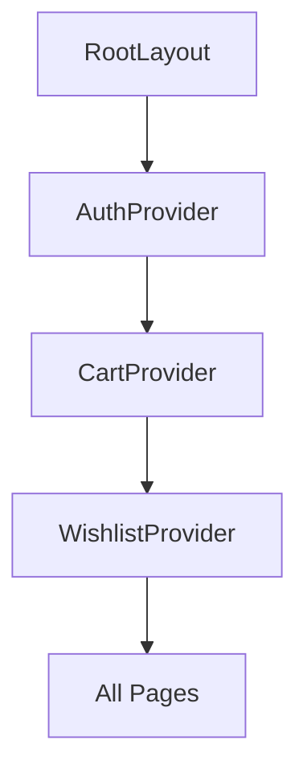

Defined in `app/layout.jsx:25-30`:

```
<AuthProvider>
  <CartProvider>
    <WishlistProvider>
      <AnnouncementBar />
      <Navbar />
      <main>{children}</main>
      <ToastNotification />
      <Footer />
    </WishlistProvider>
  </CartProvider>
</AuthProvider>
```

**Important**: `OrderContext` is defined in `context/OrderContext.js` but is **NOT** included in the root layout. It is not used by any page component directly — pages use `orderService` directly.

### Provider Dependency Order

1. `AuthProvider` — outermost, provides `user` object
2. `CartProvider` — depends on nothing (but uses `saleService` directly)
3. `WishlistProvider` — depends on `AuthProvider` (uses `user.uid`)

### ToastNotification Component

Inline in `layout.jsx`: reads `useCart().notification`, auto-dismisses after 3s, positioned fixed bottom-right.

---

## 6. Authentication Flow

### 6.1 Provider & Initialization

**File**: `context/AuthContext.js`

- Wraps entire app
- On mount: subscribes to `onAuthStateChanged` via `authService.subscribeToAuthState()`
- On auth event: fetches user profile from Firestore `users/{uid}` collection
- Merges Firebase Auth user + Firestore profile into a single `user` object
- Sets `loading = false` once initial auth resolution completes

### 6.2 User Object Shape

```js
{
  uid: string,
  email: string,
  displayName: string,
  role: "customer" | "admin",
  photoURL: string | null,
  emailVerified: boolean,
}
```

`isAdmin` derived: `user?.role === "admin"`

### 6.3 Sign Up Flow

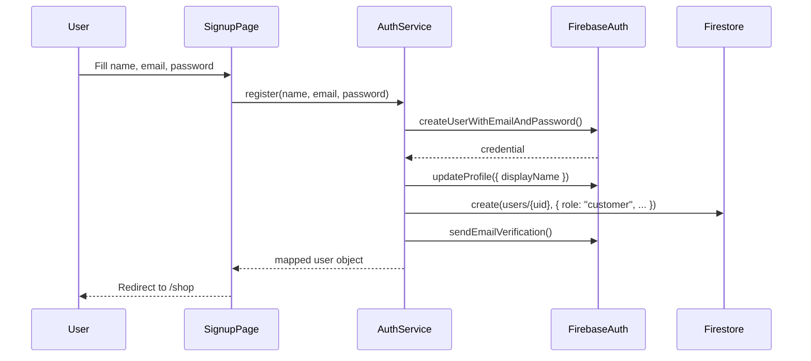

- Firebase Auth `uid` is used as the Firestore `users/{uid}` document ID
- Default role is `"customer"`
- Email verification email is sent on signup (not enforced server-side)

### 6.4 Login Flow

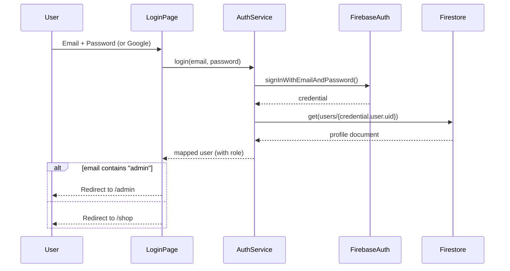

### 6.5 Google Login

**File**: `services/AuthService.js:65-85`

- Calls `signInWithPopup(auth, googleProvider)`
- Checks if Firestore user document exists; if not, creates one with `role: "customer"`
- Returns mapped user object

### 6.6 Demo Admin Quick Login

**File**: `app/login/page.jsx`

A button on the login page auto-fills:
- Email: `admin@versatileByVersa.com`
- Password: `admin123`

The login page detects if the email contains "admin" and redirects to `/admin` accordingly.

### 6.7 Logout

- `AuthContext.logout()` calls `authService.logout()` → `signOut(auth)`
- Sets `user` to `null`
- Navbar user dropdown provides the logout button
- On logout, redirects to `/`

### 6.8 Session Restore

- On page reload, `onAuthStateChanged` fires
- Firebase SDK restores the auth session from local storage
- `subscribeToAuthState` fetches the Firestore profile
- `loading` is `true` until auth resolves (used for protected route rendering)

### 6.9 Forgot Password

- `AuthContext.forgotPassword(email)` → `authService.forgotPassword(email)` → `sendPasswordResetEmail(auth, email)`
- No dedicated "forgot password" page — available through `AuthService` only

### 6.10 Protected Routes

- `/orders` — checks `if (!user)` and shows sign-in prompt
- `/wishlist` — checks `if (!user)` and shows sign-in prompt
- `/checkout` — checks `if (!user)` and shows error when placing order
- `/admin` — no explicit guard, but relies on user role; page renders null if not admin
- **No middleware protection** — all checks are client-side

---

## 7. Home Page Flow

**File**: `app/page.jsx` (291 lines)

### 7.1 Data Loading

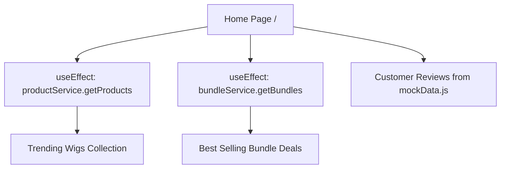

- Products are fetched via `productService.getProducts()` — returns ALL products from Firestore
- Bundles are fetched via `bundleService.getBundles()` — returns ALL bundles from Firestore
- Reviews section uses hardcoded `REVIEWS` from `lib/mockData.js` — **NOT from Firestore**
- Loading state shows `ProductGridShimmer` (4 skeleton cards)

### 7.2 Sections

| Section | Source | Description |
|---------|--------|-------------|
| Hero | Static JSX | Gradient background, tagline, CTA buttons |
| Features Banner | Static JSX | 4 feature cards (Swiss Lace, Virgin Hair, Express Delivery, 30-Day Guarantee) |
| Trending Wigs | `productService.getProducts()` | Grid of `ProductCard` components |
| Best Selling Bundles | `bundleService.getBundles()` | Grid of `BundleCard` components |
| Customer Reviews | `mockData.js` REVIEWS | 3 static review cards with star ratings |

---

## 8. Shop & Product Listing Flow

**File**: `app/shop/page.jsx` (267 lines)

### 8.1 Data Source

- Uses hardcoded `INITIAL_PRODUCTS` and `INITIAL_BUNDLES` from `lib/mockData.js`
- **NOT from Firestore** — The shop page does NOT call productService.getProducts()
- Filtering and search are entirely client-side on the mock data array

### 8.2 Filters

| Filter Type | Implementation | Details |
|------------|---------------|---------|
| Category | State filter | Straight Wigs, Wave Wigs, Curly Wigs, Colored Wigs, HD Laces & Closures |
| Max Price | `<input type="range">` | $100–$500 slider |
| Hair Length | Toggle buttons | 10" through 26" |
| Sort | Dropdown | Featured, Price Low-High, Price High-Low, Highest Rated |

### 8.3 Limitations

- **Partially Implemented**: Stock display not connected to Firestore
- **Partially Implemented**: Search input exists in Navbar as a UI modal but has no backend search logic wired
- The "Simulate Loading Shimmer" button at the bottom is a debug toggle

---

## 9. Product Detail Flow

**File**: `app/product/[id]/page.jsx` (320 lines)

### 9.1 Data Loading

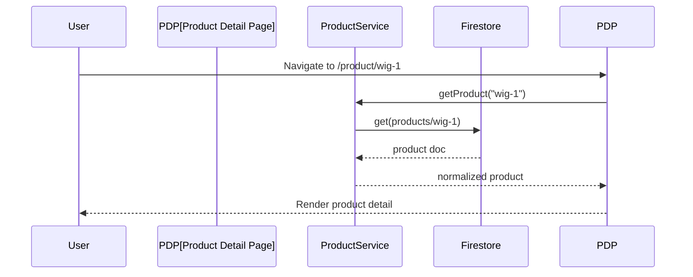

### 9.2 Variant Logic

- Product has `sizes` array: `[{ size: '12"', price: 129, stock: 10, image: "..." }, ...]`
- User selects a size — price, image, and stock update reactively
- Current price = selected variant's `price`
- If product is on sale (`isOnSale: true`), `discountPercent` is displayed as a badge

### 9.3 Stock Display

| Stock Level | Display |
|-------------|---------|
| `stock > 10` | "In Stock" (green badge) |
| `stock > 0 && stock <= 10` | "Low Stock — Only N left" (amber badge) |
| `stock === 0` or undefined | "Sold Out" (disabled button, gray badge) |

### 9.4 Sale Price Logic

- `product.originalPrice` is shown with strikethrough
- If `isOnSale`, a "X% OFF" badge overlays the image
- The displayed price is the variant's price (sales are applied as discount badges only, not price reductions on the detail page — price reductions happen at checkout via promo code)

### 9.5 Image Logic

- Main image = selected variant's image or product's `image` field
- Thumbnails carousel shows variant images
- `Image` component uses `fill` with `object-contain`
- `next.config.mjs` sets `images.unoptimized: true` (serves images as-is)

### 9.6 Add to Cart

- Calls `addToCart(product, currentVariant, qty, "product")` from `CartContext`
- Notification toast: "Added Nx Product Name (Size)"

### 9.7 Related Products

- Hardcoded: shows 3 products from `INITIAL_PROUCTS` (typo in code — references `INITIAL_PROUCTS` instead of `INITIAL_PRODUCTS`)
- Filtered by `product.id !== params.id`

### 9.8 Reviews Section

- Uses `useReviews(params.id)` hook
- Renders `ProductReviews` component with average rating, star distribution bars, review cards, and review form
- **Known Issue**: The hook reference uses `INITIAL_PROUCTS` (typo) — likely broken

---

## 10. Bundle Flow

### 10.1 Data Model

```js
{
  id: "bundle-1",
  title: "3 Bundles + 13x4 HD Frontal Deal",
  price: 320,
  originalPrice: 420,
  savings: "$100 OFF",
  image: "/images/bundle.jpeg",
  includes: ["3x Straight Virgin Bundles...", "1x 13x4 HD Swiss Lace Frontal", "..."],
  popular: true,
}
```

### 10.2 Bundle in Cart

- When added to cart, `itemType = "bundle"`, `size = "Bundle Deal"`
- Bundle is treated as a single line item with its price
- No variant selection for bundles
- In cart display, bundles show "Bundle Deal" as size

### 10.3 Bundle Differences from Products

| Aspect | Product | Bundle |
|--------|---------|--------|
| Variants | Multiple sizes with stock | Single price, no variants |
| Stock tracking | Per-variant stock count | No stock tracking |
| Admin CRUD | ProductForm + ProductCatalogList | BundleForm + BundleList |
| Checkout validation | Validates stock per variant | Validates bundle exists |
| Review eligibility | Eligible after delivered purchase | **Not eligible for review** |

---

## 11. Cart Flow

**Files**: `context/CartContext.js`, `app/cart/page.jsx`

### 11.1 Architecture

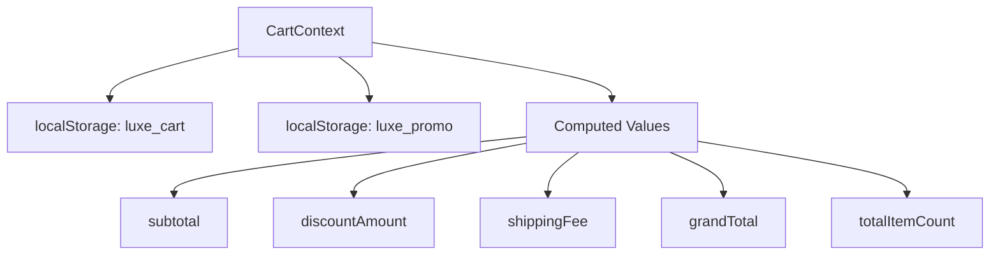

### 11.2 State

```js
cartItems = [
  {
    id: string,          // `${productId}-${size}-${Date.now()}`
    productId: string,
    name: string,
    category: string,
    size: string,        // e.g. "20"" or "Bundle Deal"
    price: number,
    image: string,
    qty: number,
    itemType: "product" | "bundle"
  }
]
```

### 11.3 Persistence

- **Cart**: Saved to `localStorage` key `luxe_cart` as JSON
- **Promo Code**: Saved to `localStorage` key `luxe_promo` as `{ code, sale }`
- Hydrated on mount via `useEffect`
- Synced on every change via `useEffect` dependency on `cartItems`
- **No Firestore sync** — Cart is client-side only, even for logged-in users

### 11.4 Computed Values

| Value | Formula |
|-------|---------|
| `subtotal` | `sum(item.price * item.qty)` |
| `discountAmount` | Promo code discount (flash = sitewide %, category = category items only %) |
| `shippingFee` | `$15` if subtotal < $199, `$0` otherwise |
| `grandTotal` | `max(0, subtotal - discountAmount + shippingFee)` |
| `totalItemCount` | `sum(item.qty)` |

### 11.5 Actions

| Action | Description |
|--------|-------------|
| `addToCart(product, variant, qty, type)` | Adds item or increments qty if same product+size exists |
| `updateQuantity(index, qty)` | Updates qty (removes if qty < 1) |
| `removeItem(index)` | Removes item by index |
| `clearCart()` | Empties cart, resets promo code |
| `applyPromoCode(code)` | Validates via `saleService.validatePromoCode()`, updates state |
| `clearPromo()` | Clears promo code state |

### 11.6 Cart Page (`/cart`)

- **Free Shipping Progress Bar**: Shows progress toward $199 threshold
- **Cart Items**: Image, name, size, price, quantity +/- controls, subtotal, remove button
- **Order Summary**: Subtotal, discount, shipping, grand total
- **Promo Code Input**: Suggests "LUXE20" as placeholder
- **Proceed to Checkout**: Button links to `/checkout`
- **Empty State**: Illustration with link to `/shop`

---

## 12. Wishlist Flow

**Files**: `context/WishlistContext.js`, `services/WishlistService.js`, `app/wishlist/page.jsx`

### 12.1 Data Model

```
Firestore: wishlists/{auto-generated-id}
{
  userId: string,
  items: [
    {
      productId: string,
      name: string,
      category: string,
      price: number,
      image: string,
      addedAt: ISO string
    }
  ]
}
```

### 12.2 State Management

- `WishlistContext` wraps the app below `CartProvider`
- Depends on `AuthContext.user` — null when logged out
- On mount or user change: calls `refreshWishlist()`
- `wishlistCount = wishlist?.items?.length || 0` — drives the heart icon badge in Navbar

### 12.3 Actions

| Action | Description |
|--------|-------------|
| `addToWishlist(product)` | Add item or skip if already exists |
| `removeFromWishlist(productId)` | Remove item; deletes doc if last item |
| `clearWishlist()` | Delete entire wishlist doc |
| `isInWishlist(productId)` | Check if product is wishlisted |
| `refreshWishlist()` | Re-fetch from Firestore |

### 12.4 After Successful Order

- **COD**: `clearWishlist()` called after `orderService.createOrder()` succeeds
- **Stripe**: `clearWishlist()` called when `/checkout/success` page confirms the order via `/api/checkout/verify`
- Wishlist count in Navbar updates immediately via `wishlistCount` state

### 12.5 Wishlist Page (`/wishlist`)

- If not logged in: sign-in prompt with link to `/login`
- If loading: pulse animation skeleton
- If empty: empty state with link to `/shop`
- Otherwise: grid of wishlist items with "Add to Cart" and "Remove" buttons

---

## 13. Checkout Flow

**File**: `app/checkout/page.jsx` (640 lines)

### 13.1 Overview

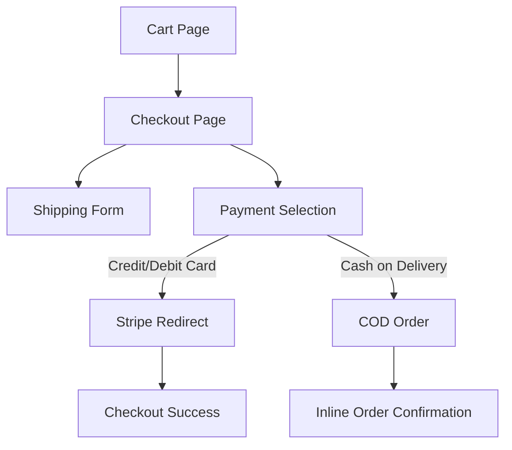

### 13.2 Shipping Form

Fields: firstName, lastName, email, phone, address, city, zip

### 13.3 Payment Options

- **Credit/Debit Card (Stripe)**: Selected by default
- **Cash on Delivery**: Alternative option
- Stripe availability: checked via `NEXT_PUBLIC_STRIPE_PUBLISHABLE_KEY` env var
- If Stripe key is missing, recommends COD with a warning banner

### 13.4 Validations

| Check | Implementation |
|-------|---------------|
| Form completeness | Client-side `validateForm()` — checks all fields non-empty |
| Cart non-empty | `cartItems.length === 0` guard |
| Auth required | `if (!user)` guard |
| Item stock | Server-side in `/api/checkout` route |
| Promo code | Server-side via `saleService.validatePromoCode()` |

---

## 14. Cash on Delivery (COD) Flow

### 14.1 Sequence

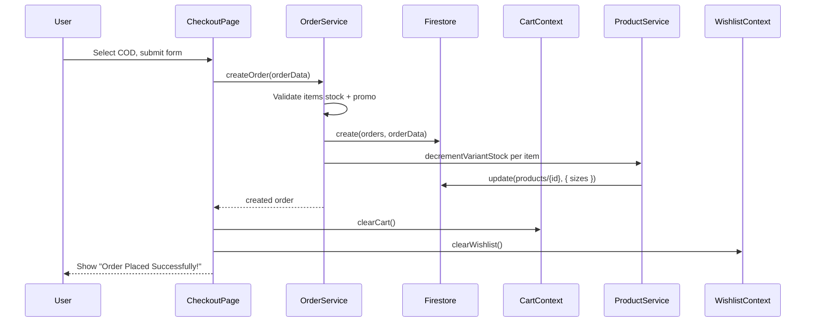

### 14.2 Order Data Shape (COD)

```js
{
  userId: user.uid,
  userName: user.displayName,
  email: formData.email,
  phone: formData.phone,
  shippingAddress: { firstName, lastName, address, city, zip },
  items: [...cartItems mapped],
  subtotal,
  discountAmount,
  discountPercent: appliedSale?.discountPercent || 0,
  shippingFee,
  totalAfterDiscount: max(0, subtotal - discountAmount),
  total: grandTotal,
  paymentMethod: "cod",
  paymentStatus: "Pending",
  orderStatus: "Pending",
  promoCode: promoCode || null,
  appliedSaleId: appliedSale?.id || null,
  createdAt: ISO string,
  updatedAt: ISO string,
}
```

### 14.3 Success State

- Order reference displayed: `#LX-{orderId.slice(-8)}`
- Cart cleared, wishlist cleared
- "View My Orders" link to `/orders`

---

## 15. Stripe Payment Flow

### 15.1 Architecture

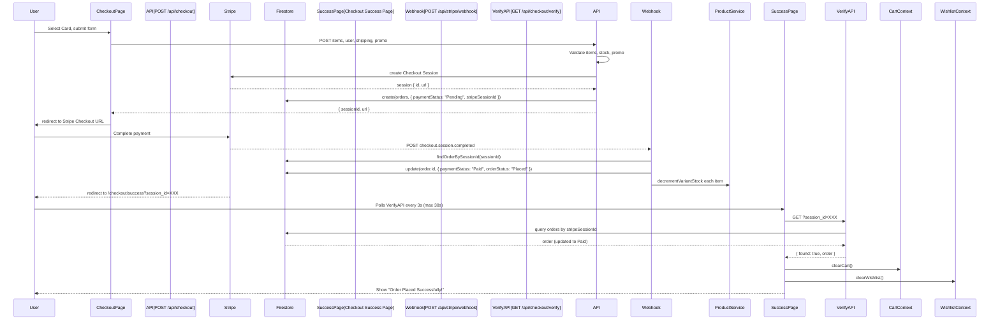

### 15.2 Checkout Session Creation (`/api/checkout`)

| Step | Description |
|------|-------------|
| 1 | Validates items array, userId, email, shipping address |
| 2 | For each item: validates product/bundle exists, variant exists, stock sufficient |
| 3 | Calculates subtotal from validated item prices |
| 4 | Applies promo code via `saleService.validatePromoCode()` + `calculateDiscount()` |
| 5 | Computes shipping fee ($15 if subtotal < $199, free otherwise) |
| 6 | Builds Stripe line items with per-item discounted pricing |
| 7 | Creates Stripe Checkout Session with metadata (userId, promo details, totals) |
| 8 | Creates order in Firestore `orders` with `paymentStatus: "Pending"`, `stripeSessionId` |
| 9 | Returns `{ sessionId, url }` |

### 15.3 Metadata Passed to Stripe

```js
session.metadata = {
  userId,
  promoCode,
  discountPercent,
  discountAmount,
  subtotal,
  shippingFee,
  totalAfterDiscount,
  total,
}
```

### 15.4 Stripe Webhook (`/api/stripe/webhook`)

**Events handled**:

| Event | Action |
|-------|--------|
| `checkout.session.completed` | Update order to Paid/Placed, decrement stock |
| `checkout.session.async_payment_succeeded` | Same as above |
| `checkout.session.async_payment_failed` | Update order to Cancelled/Failed |
| `payment_intent.payment_failed` | Update order to Cancelled/Failed |

**Webhook handler (`handlePaymentSuccess`)**:

1. Calls `findOrderBySessionId(sessionId)` — queries `orders` by `stripeSessionId`
2. If no order found: logs error, returns (order may not have been created)
3. If order already `paymentStatus === "Paid"`: skips (idempotency guard)
4. Updates order: `paymentStatus: "Paid"`, `orderStatus: "Placed"`, adds Stripe payment details, `paidAt`
5. Decrements variant stock for each non-bundle item

**Webhook handler (`handlePaymentFailed`)**:

1. Finds order by session ID
2. If found and still `paymentStatus === "Pending"`: updates to `Cancelled`/`Failed`

### 15.5 Verify API (`/api/checkout/verify`)

- `GET /api/checkout/verify?session_id=cs_test_...`
- Queries `orders` collection by `stripeSessionId`
- Returns `{ found: true, order: { id, orderStatus, paymentStatus, items, totals... } }`
- Success page polls this endpoint every 3 seconds for up to 30 seconds

### 15.6 Success Page (`/checkout/success`)

States:

| State | Description |
|-------|-------------|
| `verifying` | Polling the verify API — shows spinner |
| `not_found` | Verify API returns `found: false` — continues polling |
| `confirmed` | Order found — shows success, clears cart + wishlist |
| `timeout` | 30s elapsed without confirmation — shows "Payment Successful" anyway |
| `error` | Fetch error — shows error message with links |

### 15.7 Cancel Page (`/checkout/cancelled`)

- Shows "Payment Cancelled" message
- Links to checkout, shop, and cart
- Cart items are preserved

---

## 16. Order Flow

### 16.1 Order Creation

**Paths**:
- **COD**: `OrderService.createOrder()` → validates → creates Firestore doc → decrements stock
- **Stripe**: Created as `"Pending"` in `/api/checkout` route → updated to `"Paid"` by webhook

### 16.2 Order Lifecycle

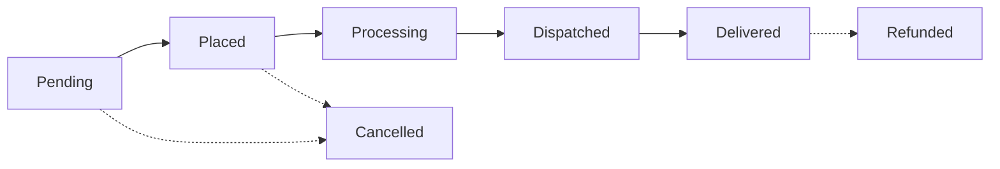

Valid statuses: `Pending`, `Placed`, `Processing`, `Dispatched`, `Delivered`, `Cancelled`, `Refunded`

### 16.3 Order Data Shape

```js
{
  userId: string,
  userName: string,
  email: string,
  phone: string,
  shippingAddress: { firstName, lastName, address, city, zip },
  items: [{ productId, name, category, price, size, image, qty, itemType }],
  subtotal: number,
  discountAmount: number,
  discountPercent: number,
  shippingFee: number,
  totalAfterDiscount: number,
  total: number,
  paymentMethod: "cod" | "stripe",
  paymentStatus: "Pending" | "Paid" | "Failed",
  orderStatus: "Pending" | "Placed" | "Processing" | "Dispatched" | "Delivered" | "Cancelled" | "Refunded",
  promoCode: string | null,
  appliedSaleId: string | null,
  stripeSessionId: string | null,
  stripePaymentIntentId: string | null,
  stripeCustomerId: string | null,
  paidAt: ISO string | null,
  createdAt: ISO string,
  updatedAt: Firestore serverTimestamp,
}
```

### 16.4 Order Validation (OrderService.createOrder)

1. Validates order status is in `ORDER_STATUSES`
2. For each item:
   - Bundle: validates bundle exists
   - Product: validates product + variant exists, validates stock availability
3. If promo code provided: re-validates via `saleService.validatePromoCode()`, checks discount amount matches
4. On success: creates Firestore doc, decrements variant stock

---

## 17. Orders Page (Customer)

**File**: `app/orders/page.jsx` (260 lines)

### 17.1 Flow

1. Checks `useAuth().user` — if null, shows "sign in to view" prompt
2. If auth loading, shows loading state
3. Calls `orderService.getOrdersByUser(user.uid)` — queries Firestore orders by userId
4. Renders each order as an `OrderCard` component (inline sub-component)

### 17.2 Order Card Display

- Order ID: `#LX-{orderId.slice(-8)}`
- Date: formatted `createdAt`
- Status badge with color mapping (Pending→amber, Placed→blue, etc.)
- Payment method badge (COD / Card)
- Payment status badge (Paid→emerald, Pending→amber, Failed→red)
- Items: first item thumbnail, name, qty
- Total amount
- No status change action for customers

---

## 18. Review Flow

**Files**: `hooks/useReviews.js`, `services/ReviewService.js`, `components/ProductReviews/`

### 18.1 Permission Check

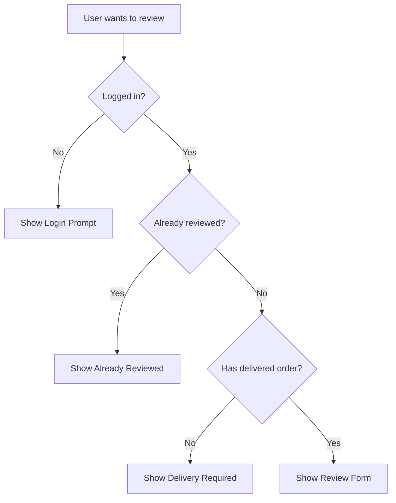

### 18.2 Review Creation

1. User fills star rating (1-5) + review text
2. `useReviews().addReview({ rating, reviewText })` → `reviewService.createReview()`
3. Service checks permission again server-side
4. Creates Firestore doc in `reviews` collection
5. Calls `syncProductRatingAggregates(productId)` — updates product's `averageRating`, `ratingCount`, `ratingSum`
6. New review is prepended to the local reviews array

### 18.3 Rating Aggregation

- `calculateAverageRating`: sum of ratings / count, rounded to 1 decimal
- `calculateStarDistribution`: counts per star level + percentages
- On every review create/update/delete: `syncProductRatingAggregates` updates the product document

### 18.4 Reviews on Product Page

- `<ProductReviews>` component shows:
  - Average rating (large number)
  - Star distribution bars
  - Individual review cards
  - Review form (if eligible)
- Uses `useReviews(productId)` hook

---

## 19. Sale & Promo Code Flow

**File**: `services/SaleService.js`

### 19.1 Sale Types

| Type | Behavior |
|------|----------|
| `flash` | Sitewide discount on all items |
| `category` | Discount only on items matching `sale.category` |

### 19.2 Sale Data Shape

```js
{
  id: string,
  title: string,
  saleType: "flash" | "category",
  category: string,           // only for category sales
  promoCode: string,          // uppercase
  discountPercent: number,
  startDate: ISO string | null,
  endDate: ISO string | null,
  active: boolean,
  showInHeader: boolean,      // show in AnnouncementBar
  bannerText: string,         // AnnouncementBar message
  noteText: string,           // shown in checkout summary
  buttonText: string,         // unused currently
}
```

### 19.3 Promo Code Validation Flow

```
1. User enters code in cart or checkout
2. CartContext.applyPromoCode(code) calls saleService.validatePromoCode(code)
3. Service:
   a. Normalizes code to uppercase
   b. Fetches all sales from Firestore
   c. Finds matching sale by promoCode
   d. Checks: active === true
   e. Checks: startDate <= now <= endDate
4. Returns { valid: boolean, sale: sale | null, message: string }
```

### 19.4 Discount Calculation

```js
if (saleType === "flash" || item.category === sale.category) {
  discountAmount = itemTotal * discountPercent / 100;
}
```

Discount is calculated:
- Per-item in `/api/checkout` (server-side) for Stripe line items
- In `CartContext` via `useMemo` for cart/checkout display
- Re-validated in `OrderService.createOrder()` for COD orders

### 19.5 Announcement Bar

- `AnnouncementBar` component fetches `saleService.getActiveSale()`
- Renders if `sale.active && sale.showInHeader`
- Shows: icon, banner text, promo code pill, countdown timer (HH:MM:SS)

---

## 20. Admin Panel Flow

**File**: `app/admin/page.jsx` (718 lines) + `components/admin/`

### 20.1 Dashboard

Stats cards (hardcoded values):
- Total Sales: $24,850
- Products: `productList.length`
- Active Sale: dynamic % from sales
- Bundle Deals: `bundleList.length`

### 20.2 Tabs

| Tab | Component | Description |
|-----|-----------|-------------|
| Orders | `OrdersSection` + `AdminOrderCard` | Order list with status update |
| Product Manager | `ProductForm` + `ProductCatalogList` | CRUD products + restock |
| Launch Sales | `SaleManagerSection` | CRUD sales/promo codes |
| Create Bundles | `BundleForm` + `BundleList` | CRUD bundles |

### 20.3 Orders Tab

- Calls `orderService.getAllOrders()` — fetches ALL orders from Firestore (no pagination)
- Splits into "Today's Orders" and "Earlier Orders" by comparing `createdAt` date to current date
- Each order card shows: ID, status badge, customer name, payment method/status, total, items
- Admin can change order status via dropdown (all `ORDER_STATUSES` options)

### 20.4 Products Tab

- **ProductForm**: fields for name, category, description, price, sizes (with individual stock), details, images
- **ProductCatalogList**: searchable list with edit, delete, restock actions
- Image upload to Firebase Storage via `uploadProductImages`
- `RestockModal`: allows admin to update stock for a specific variant size

### 20.5 Sales Tab

- **SaleManagerSection**: form to create/edit sales with title, type, promo code, discount %, dates, banner settings
- Searchable list with toggle for active status

### 20.6 Bundles Tab

- **BundleForm**: title, price, savings, image upload, includes editor
- **BundleList**: searchable list with edit, delete

### 20.7 Notification System

- `notify(msg, type)` function with auto-dismiss after 3.5s
- Renders a fixed notification toast near bottom

---

## 21. Database Collections

### 21.1 Collection Overview

```
Firestore Root
├── users/{userId}
├── products/{productId}
├── bundles/{bundleId}
├── reviews/{reviewId}
├── orders/{orderId}
├── sales/{saleId}
└── wishlists/{auto-id}
```

### 21.2 `users`

| Field | Type | Required | Notes |
|-------|------|----------|-------|
| `uid` | String | Yes | Firebase Auth UID |
| `email` | String | Yes | |
| `displayName` | String | Yes | |
| `role` | String | Yes | `"customer"` or `"admin"` |
| `photoURL` | String | No | |
| `createdAt` | Timestamp | Yes | Set by DBService |
| `updatedAt` | Timestamp | Yes | Set by DBService |

**Doc ID**: Firebase Auth UID
**Used by**: AuthService
**Read**: Owner or Admin
**Write**: AuthService (create), User (update own)

### 21.3 `products`

| Field | Type | Required | Notes |
|-------|------|----------|-------|
| `name` | String | Yes | |
| `category` | String | Yes | Straight Wigs, Wave Wigs, Curly Wigs, Colored Wigs, HD Laces & Closures |
| `price` | Number | Yes | Current sale price |
| `originalPrice` | Number | No | Original price |
| `discountPercent` | Number | No | |
| `isOnSale` | Boolean | Yes | |
| `rating` / `averageRating` | Number | Yes | |
| `reviewsCount` / `ratingCount` | Number | Yes | |
| `ratingSum` | Number | Yes | |
| `image` | String | Yes | Main image path |
| `description` | String | Yes | |
| `sizes` | Array | Yes | `[{ size, price, stock, image }]` |
| `details` | Map | Yes | `{ hairType, capSize, density, laceType }` |
| `images` | Array | No | Uploaded image objects `[{ downloadURL, storagePath }]` |
| `createdAt` | Timestamp | Yes | |
| `updatedAt` | Timestamp | Yes | |

**Doc ID**: Custom (e.g., `wig-1`)
**Used by**: ProductService
**Read**: Public
**Write**: Admin

### 21.4 `bundles`

| Field | Type | Notes |
|-------|------|-------|
| `title` | String | |
| `price` | Number | |
| `originalPrice` | Number | |
| `savings` | String | Display text like "$100 OFF" |
| `image` | String | |
| `includes` | Array of Strings | |
| `popular` | Boolean | Highlights as best seller |
| `createdAt` | Timestamp | |
| `updatedAt` | Timestamp | |

**Used by**: BundleService
**Read**: Public
**Write**: Admin

### 21.5 `reviews`

| Field | Type | Notes |
|-------|------|-------|
| `productId` | String | Reference to product |
| `userId` | String | Reference to user |
| `userName` | String | |
| `userEmail` | String | |
| `rating` | Number | 1-5 |
| `reviewText` | String | |
| `verified` | Boolean | Always `true` |
| `image` | Object | Optional review image `{ downloadURL, storagePath }` |
| `createdAt` | Timestamp | |
| `updatedAt` | Timestamp | |

**Used by**: ReviewService
**Read**: Public
**Write**: Authenticated users (with delivered purchase + not already reviewed)

### 21.6 `orders`

| Field | Type | Notes |
|-------|------|-------|
| `userId` | String | |
| `userName` | String | |
| `email` | String | |
| `phone` | String | |
| `shippingAddress` | Map | `{ firstName, lastName, address, city, zip }` |
| `items` | Array | `[{ productId, name, category, price, size, image, qty, itemType }]` |
| `subtotal` | Number | |
| `discountAmount` | Number | |
| `discountPercent` | Number | |
| `shippingFee` | Number | |
| `totalAfterDiscount` | Number | |
| `total` | Number | Grand total |
| `paymentMethod` | String | `"cod"` or `"stripe"` |
| `paymentStatus` | String | `"Pending"`, `"Paid"`, `"Failed"` |
| `orderStatus` | String | `"Pending"`, `"Placed"`, `"Processing"`, `"Dispatched"`, `"Delivered"`, `"Cancelled"`, `"Refunded"` |
| `promoCode` | String | Nullable |
| `appliedSaleId` | String | Nullable |
| `stripeSessionId` | String | Nullable, for Stripe orders |
| `stripePaymentIntentId` | String | Nullable |
| `stripeCustomerId` | String | Nullable |
| `paidAt` | String | ISO timestamp, Nullable |
| `createdAt` | String/Timestamp | |
| `updatedAt` | Timestamp | |

**Used by**: OrderService
**Read**: Owner or Admin
**Write**: Authenticated (create own), Admin (update status)

### 21.7 `sales`

| Field | Type | Notes |
|-------|------|-------|
| `title` | String | |
| `saleType` | String | `"flash"` or `"category"` |
| `category` | String | For category sales |
| `promoCode` | String | Uppercase |
| `discountPercent` | Number | |
| `startDate` | String | ISO or null |
| `endDate` | String | ISO or null |
| `active` | Boolean | |
| `showInHeader` | Boolean | |
| `bannerText` | String | |
| `noteText` | String | |
| `buttonText` | String | |
| `createdAt` | Timestamp | |
| `updatedAt` | Timestamp | |

**Used by**: SaleService
**Read**: Public
**Write**: Admin

### 21.8 `wishlists`

| Field | Type | Notes |
|-------|------|-------|
| `userId` | String | |
| `items` | Array | `[{ productId, name, category, price, image, addedAt }]` |
| `createdAt` | Timestamp | |
| `updatedAt` | Timestamp | |

**Used by**: WishlistService
**Read**: Owner
**Write**: Owner

---

## 22. Service Layer

### 22.1 DBService (`services/DBService.js`)

Low-level abstraction over Firebase Firestore and Storage. All other services depend on this.

| Method | Parameters | Description |
|--------|-----------|-------------|
| `create(collection, data, documentId?)` | collection name, data object, optional doc ID | Creates doc (addDoc or setDoc) |
| `get(collection, id)` | collection, doc ID | Returns doc or null |
| `getAll(collection)` | collection | Returns all docs |
| `update(collection, id, data)` | collection, doc ID, partial data | Updates doc fields |
| `delete(collection, id)` | collection, doc ID | Deletes doc |
| `query(collection, constraints)` | collection, Firestore constraints | Runs query with where/orderBy/limit |
| `uploadFile(file, path)` | File/Blob, storage path | Uploads to Firebase Storage |
| `deleteFile(storagePath)` | storage path | Deletes from Firebase Storage |
| `getFileURL(storagePath)` | storage path | Returns download URL |

### 22.2 AuthService (`services/AuthService.js`)

- Manages Firebase Auth + Firestore user profiles
- Provides: `register`, `login`, `logout`, `googleLogin`, `forgotPassword`, `verifyEmail`, `getCurrentUser`, `updateProfile`, `createUserDocument`, `subscribeToAuthState`
- `mapAuthUser()` transforms Firebase user + Firestore profile into app user object
- `formatAuthError()` maps Firebase error codes to user-friendly messages

### 22.3 ProductService (`services/ProductService.js`)

- CRUD: `createProduct`, `updateProduct`, `deleteProduct`, `getProduct`, `getProducts`
- Search: `searchProducts(searchTerm)` — client-side filter on all products
- Variants: `getVariantBySize(product, size)`, `updateVariantStock`, `decrementVariantStock`
- Images: `uploadProductImages(productId, files)` — uploads to Storage, updates product doc
- Sale: `toggleSale(productId, isOnSale, saleFields)`
- Normalization: `normalizeProduct()` — ensures consistent `rating`, `reviewsCount`, `image` fields

### 22.4 OrderService (`services/OrderService.js`)

- CRUD: `createOrder`, `getOrder`, `getOrdersByUser`, `getAllOrders`
- Status management: `updateOrderStatus`, `cancelOrder`
- Review eligibility: `hasDeliveredProduct(userId, productId, orders)` — checks if user has a delivered order for a product
- `createOrder` validates stock + promo before creation, decrements stock on success

### 22.5 ReviewService (`services/ReviewService.js`)

- CRUD: `createReview`, `updateReview`, `deleteReview`
- Query: `getProductReviews(productId)` — ordered by createdAt desc
- Permission: `canUserReview(userId, productId)` — checks auth, duplicate, delivered purchase
- Rating sync: `syncProductRatingAggregates(productId)` — recalculates and updates product rating fields
- Rating calculation: `calculateAverageRating(productId)`

### 22.6 SaleService (`services/SaleService.js`)

- CRUD: `createSale`, `updateSale`, `deleteSale`, `getSale`, `getSales`
- Query: `getActiveSale()`, `searchSales(term)`
- Promo: `validatePromoCode(code)` — checks active, date range
- Math: `calculateDiscount(promoCode, items)` — returns `{ discountAmount, eligibleItems, saleId, discountPercent }`
- Helpers: `isSaleExpired(sale)`, `isSaleActive(sale)`, `normalizeSale(sale)`

### 22.7 BundleService (`services/BundleService.js`)

- CRUD: `createBundle`, `updateBundle`, `deleteBundle`, `getBundle`, `getBundles`, `searchBundles`
- Image: `uploadBundleImage(bundleId, file)`

### 22.8 WishlistService (`services/WishlistService.js`)

- `getWishlist(userId)` — queries wishlists by userId, returns first match
- `addToWishlist(userId, product)` — upserts item to existing or new wishlist
- `removeFromWishlist(userId, productId)` — removes item; deletes doc if empty
- `clearWishlist(userId)` — deletes wishlist doc entirely
- `isInWishlist(wishlist, productId)` — pure function check

---

## 23. State Management

### 23.1 AuthContext

| State | Type | Initial |
|-------|------|---------|
| `user` | Object/null | `null` |
| `loading` | Boolean | `true` |

| Actions | Description |
|---------|-------------|
| `login(email, password)` | Authenticate + fetch profile |
| `signup(name, email, password)` | Register + create profile |
| `logout()` | Sign out |
| `googleLogin()` | Google OAuth |
| `forgotPassword(email)` | Send reset email |
| `verifyEmail()` | Send verification email |
| `updateProfile(data)` | Update displayName, photoURL |

| Derived | Value |
|---------|-------|
| `isAdmin` | `user?.role === "admin"` |

**Persistence**: Firebase Auth SDK manages session tokens (automatic on reload)

### 23.2 CartContext

| State | Type | Persistence |
|-------|------|-------------|
| `cartItems` | Array | `localStorage: luxe_cart` |
| `promoCode` | String | `localStorage: luxe_promo` |
| `appliedSale` | Object/null | `localStorage: luxe_promo` |
| `notification` | String/null | No (transient) |

| Computed | Formula |
|----------|---------|
| `subtotal` | `sum(item.price * item.qty)` |
| `discountAmount` | Percent-based, category-aware |
| `shippingFee` | `$15` if subtotal < `$199`, else `$0` |
| `grandTotal` | `max(0, subtotal - discount + shipping)` |
| `totalItemCount` | `sum(item.qty)` |

| Actions |
|---------|
| `addToCart(product, variant, qty, type)` |
| `updateQuantity(index, qty)` |
| `removeItem(index)` |
| `clearCart()` |
| `applyPromoCode(code)` |
| `clearPromo()` |

**No Firestore sync** — cart exists only in localStorage, even for authenticated users.

### 23.3 WishlistContext

| State | Type | Source |
|-------|------|--------|
| `wishlist` | Object/null | Firestore `wishlists` collection |
| `loading` | Boolean | `true` while fetching |

| Actions | Description |
|---------|-------------|
| `addToWishlist(product)` | Upsert item to Firestore wishlist |
| `removeFromWishlist(productId)` | Remove item from Firestore wishlist |
| `clearWishlist()` | Delete Firestore wishlist doc |
| `refreshWishlist()` | Re-fetch from Firestore |
| `isInWishlist(productId)` | Local check on cached wishlist |

| Derived | Value |
|---------|-------|
| `wishlistItems` | `wishlist?.items || []` |
| `wishlistCount` | `wishlistItems.length` |

**Persistence**: Firestore (not localStorage) — synced on user change and after mutations.

### 23.4 OrderContext

**NOT wired into the app**. The provider is not included in `layout.jsx`. Pages use `orderService` directly instead.

| State | Type |
|-------|------|
| `orders` | Array |
| `loading` | Boolean |
| `error` | String/null |

| Actions |
|---------|
| `createOrder(data)` |
| `getOrdersByUser(userId)` |
| `getAllOrders()` |
| `updateOrderStatus(id, status)` |
| `cancelOrder(id)` |

---

## 24. API Routes

### 24.1 `POST /api/checkout`

Creates a Stripe Checkout Session and a pending order in Firestore.

**Request Body**:
```json
{
  "items": [{ "productId", "name", "category", "price", "size", "image", "qty", "itemType" }],
  "userId": "string",
  "userName": "string",
  "email": "string",
  "phone": "string",
  "shippingAddress": { "firstName", "lastName", "address", "city", "zip" },
  "promoCode": "string|null"
}
```

**Response**: `{ sessionId, url }`

**Validations**: items non-empty, userId present, email present, shipping address present, each item has productId + valid qty, stock available, promo code valid.

### 24.2 `GET /api/checkout/verify`

Verifies order status after Stripe payment.

**Query**: `session_id` (Stripe session ID)

**Response**: `{ found: true, order: { id, orderStatus, paymentStatus, ... } }` or `{ found: false }`

### 24.3 `POST /api/stripe/webhook`

Handles Stripe webhook events.

**Verification**: Stripe signature via `STRIPE_WEBHOOK_SECRET`

**Events**: `checkout.session.completed`, `checkout.session.async_payment_succeeded`, `checkout.session.async_payment_failed`, `payment_intent.payment_failed`

---

## 25. Error Flows

### 25.1 Firebase Fails

| Scenario | Behavior |
|----------|----------|
| Firestore read fails | Service throws error → Component catches → Shows error state with message |
| Firestore write fails | Service throws error → Component shows error notification/alert |
| Firebase Auth fails | `AuthService.formatAuthError()` maps error code to user-friendly message |

### 25.2 Network Fails

| Scenario | Behavior |
|----------|----------|
| Stripe Checkout session creation fails | `checkout/page.jsx` shows error message, sets `isProcessing = false` |
| Stripe webhook fails | Logs error, returns 500 — order stays in "Pending" state |
| Verify API call fails | `success/page.jsx` shows error state with link to orders page |
| General fetch error | Component catches, sets error state, displays message |

### 25.3 Payment Fails

| Scenario | Behavior |
|----------|----------|
| Stripe checkout cancelled | User redirected to `/checkout/cancelled` — cart preserved |
| Webhook receives payment failure | Order updated to `Cancelled`/`Failed` — no stock decremented |
| Card declined | Handled by Stripe — redirects to cancel URL |

### 25.4 Stock Unavailable

| Scenario | Behavior |
|----------|----------|
| At checkout API | Returns 400 with error message "Insufficient stock" |
| At OrderService.createOrder | Throws error with specific stock details |
| On product page | "Sold Out" badge, button disabled |
| On product card | "Sold Out" badge, "Add" button disabled |

### 25.5 Invalid Promo Code

| Scenario | Behavior |
|----------|----------|
| In cart/checkout | `applyPromoCode()` returns `{ success: false, message }` — shown inline |
| At checkout API | Returns 400 error with validation message |
| At OrderService.createOrder | Throws error, order not created |

### 25.6 Unauthorized User

| Scenario | Behavior |
|----------|----------|
| Not logged in, visits `/wishlist` | Shows sign-in prompt with link |
| Not logged in, visits `/orders` | Shows sign-in prompt |
| Not logged in, tries to check out | Client-side guard: "Please sign in to place an order" |
| Not admin, visits `/admin` | Page renders null (no redirect) |
| Not admin, tries admin API | No server-side guard — relies on client-side UI hiding |

### 25.7 Session Expires

- Firebase Auth SDK persists sessions automatically
- On page reload, `onAuthStateChanged` fires and restores session
- If session expired, user is treated as logged out (null user)
- No middleware — individual pages handle auth state

---

## 26. Edge Cases

### 26.1 Cart

- **Duplicate items**: If same product+size added again, increments qty instead of creating duplicate
- **Quantity reduction to 0**: Automatically removes item from cart
- **Free shipping**: `subtotal === 0` also gets free shipping (empty cart)
- **Category sale on empty category**: No items match → discount = $0
- **Notification overflow**: Each add/remove clears previous timeout, shows new toast, auto-dismisses after 3s

### 26.2 Wishlist

- **Empty wishlist doc at Firestore**: If user has wishlist doc but items are empty (edge case), `wishlistCount = 0`
- **Logged-out user**: `clearWishlist()` is a no-op (returns early)
- **Concurrent add**: Service fetches existing wishlist, modifies, saves — **no transaction** used (race condition possible)

### 26.3 Checkout

- **Double webhook event**: `handlePaymentSuccess` checks `paymentStatus === "Paid"` — skips if already processed
- **Webhook fires before checkout API creates order**: `findOrderBySessionId` returns null → logs error, returns — order remains Pending
- **Success page timeout**: After 30s without confirmation, shows "Payment Successful" anyway and lets user check orders page
- **Missing session_id in URL**: Success page shows error state immediately

### 26.4 Orders

- **OrderService stock decrement fails**: Continues to next item (logged but not fatal) — potential inconsistency
- **COD + Stripe orders co-exist**: Both stored in same `orders` collection with different `paymentMethod` values — admin can filter by it

### 26.5 Reviews

- **Product not found in mock**: `INITIAL_PROUCTS` (typo) vs `INITIAL_PRODUCTS` — related products section on PDP uses the wrong variable
- **Review image upload**: Optional, happens after review creation — if upload fails, review still exists without image

### 26.6 Admin

- **Order tab lazy loads**: Admin orders only load when the tab is clicked (`useEffect` on `activeTab`)
- **No pagination**: `getAllOrders()` and `getProducts()` fetch ALL documents — potential performance issue with large datasets

---

## 27. Known Issues

| # | Issue | Severity | Location |
|---|-------|----------|----------|
| 1 | `INITIAL_PROUCTS` typo — related products section likely broken | High | `app/product/[id]/page.jsx` |
| 2 | Shop page uses mock data, not Firestore | Medium | `app/shop/page.jsx` |
| 3 | No middleware auth protection | Medium | Root level |
| 4 | OrderContext defined but not used | Low | `context/OrderContext.js` |
| 5 | No cart/Firestore sync for logged-in users | Medium | `context/CartContext.js` |
| 6 | No Firestore composite index config provided | Medium | Firestore |
| 7 | `mockOrders.js` and `checkDeliveredPurchase` unused | Low | `lib/mockOrders.js` |
| 8 | Search modal in Navbar has no backend connection | Low | `components/common/Navbar.jsx` |
| 9 | `STRIPE_WEBHOOK_SECRET` is empty in `.env` | High | `.env` |
| 10 | No pagination on admin order list | Medium | `app/admin/page.jsx` |
| 11 | No loading/error/not-found boundary files | Low | Root level |
| 12 | Static analytics in admin ($24,850 total sales) | Low | `app/admin/page.jsx` |

---

## 28. Suggested Improvements

### 28.1 Architecture

- **Move shop page to Firestore**: The shop page still uses `INITIAL_PRODUCTS` mock data. It should call `productService.getProducts()` like the home page does.
- **Wire OrderContext into layout**: Currently unused. Either integrate it properly or remove it to avoid confusion.
- **Add middleware for auth protection**: Create `middleware.ts` to protect `/orders`, `/wishlist`, `/admin`, and `/checkout` at the routing layer instead of client-side checks.
- **Server-side admin guard**: The `/api/checkout` route has no admin check. Add admin verification to admin API calls.

### 28.2 Performance

- **Add pagination**: `getAllOrders()`, `getProducts()`, `getBundles()` fetch all docs. Add `limit()` and cursor-based pagination.
- **Memoize selectors**: In cart context, `discountAmount` is already memoized. Ensure all computed values use `useMemo`.
- **Lazy load admin tabs**: Only fetch data when the tab is selected. Products and bundles are loaded eagerly in admin.
- **Image optimization**: `next.config.mjs` has `images.unoptimized: true` — enable optimization and configure proper image domains.

### 28.3 Security

- **Server-side admin verification**: The admin page hides UI elements client-side but has no server-side guard. Any API route could be called by any authenticated user.
- **Firestore security rules**: The `firebase_schema_context.md` defines rules but they need to be deployed to Firebase.
- **Webhook secret**: `STRIPE_WEBHOOK_SECRET` is empty — the webhook cannot verify signatures in production.
- **Rate limiting**: No rate limiting on auth or checkout API endpoints.

### 28.4 Code Quality

- **Fix `INITIAL_PROUCTS` typo**: Rename to `INITIAL_PRODUCTS` in `app/product/[id]/page.jsx`.
- **Remove unused files**: `lib/mockOrders.js`, `context/OrderContext.js` (if not needed).
- **Consistent timestamp handling**: Orders use ISO strings for `createdAt` but DBService sets `serverTimestamp()` for `createdAt` on other collections. Unify the approach.
- **Error boundary**: Add `error.jsx` at root and per-route level for graceful error handling.
- **Not-found page**: Add custom `not-found.jsx` for 404 handling.

### 28.5 UX & Accessibility

- **Add loading states**: Add `loading.jsx` at route segment level for automatic loading UI.
- **Keyboard navigation**: Navbar has Escape key support, but other interactive elements (dropdowns, modals) should be fully keyboard-accessible.
- **Focus management**: When modals open/close, focus should be trapped and restored.
- **Form validation feedback**: Real-time validation on checkout form instead of submit-time validation.

### 28.6 Cart & Data Persistence

- **Sync cart to Firestore**: For logged-in users, sync cart to Firestore `carts/{userId}` collection to persist across devices.
- **Guest cart merge**: When a guest logs in, merge localStorage cart with Firestore cart.

### 28.7 Stripe & Payments

- **Idempotency key**: Add idempotency key to Stripe session creation to prevent duplicate charges on retry.
- **Expand webhook error handling**: Log more webhook errors, add retry logic for stock decrement failures.
- **Payment intent status**: Monitor `payment_intent.succeeded` more granularly for async payments.

### 28.8 Admin Panel

- **Real analytics**: Replace hardcoded "$24,850" with Firestore aggregation queries.
- **Order filtering**: Add filters by payment method, payment status, date range.
- **Product image management**: Allow reordering and deleting images in the admin form.
- **Bulk stock updates**: Support bulk stock updates instead of per-variant restock modal.

### 28.9 SEO

- **Server components**: Convert static pages (Home, About) to server components where possible — currently all pages use `"use client"`.
- **Metadata**: Add `generateMetadata` for dynamic routes (`/product/[id]`) for better SEO.
- **Structured data**: Add JSON-LD schema markup for products and store.
